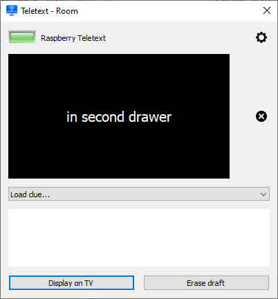
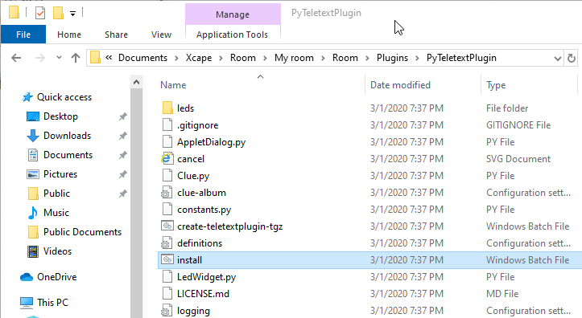
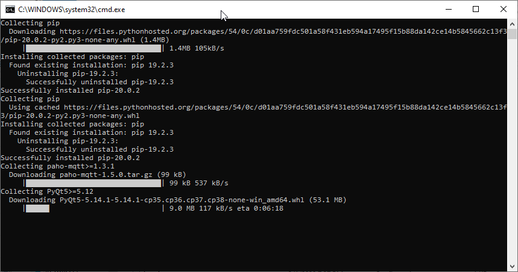
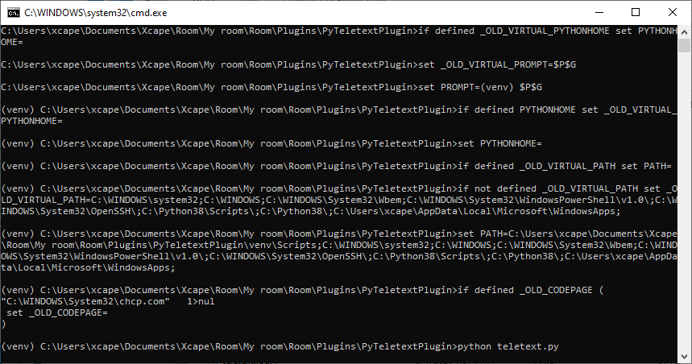
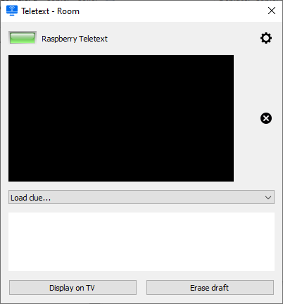

# Teletext plugin for Room
***Send MQTT messages to Raspberry connected props running TeletextProps.***

***Teletext plugin*** is a pure python applet written as a **Room** plugin, but it still can be run as a standalone Escape Room application.



You will find <a href="https://xcape.io/public/documentation/en/room/AddapluginPyTeletextPlugin.html" target="_blank">detailed installation help in the Room manual</a>.


## Installation
Download `PyTeletextPlugin-master.zip` from this GitHub repository and unflate it in Room/Plugins directory in **Room** software installation folder.

Edit `definitions.ini` to set MQTT topics for your Escape Room:
```python
[mqtt]
; mqtt-sub-* topics are subscribed by MqttApplet
mqtt-pub-props = Room/My room/Props/Raspberry Teletext/inbox
mqtt-sub-props = Room/My room/Props/Raspberry Teletext/outbox
#mqtt-sub-control-administrator = Room/My room/Control/administrator
mqtt-sub-control-scenario = Room/My room/Control/game:scenario
#mqtt-sub-control-clock-minutes=Room/My room/Control/game:clock:minutes
#mqtt-sub-control-countdown-minutes=Room/My room/Control/game:countdown:minutes
#mqtt-sub-control-players=Room/My room/Control/game:players

mqtt-sub-display = Room/My room/Props/Raspberry Teletext/display

[options]
tv-screen-width = 320
tv-screen-height = 180
``` 

Open the plugin folder on your desktop:


Run installer (double-click on `install.bat`):


If Windows Defender SmartScreen blocks execution, click **More info** and **Run anyway**

Run test (double-click on `test.bat`):




If the plugin poped-up your installation is correct.


## PluginApplet
*Teletext plugin* is a <a href="https://wiki.python.org/moin/PyQt" target="_blank">PyQt5</a> GUI application extending *MqttApplet*.

*Teletext plugin* expects to monitor a Raspberry connected props running the [Teletext Props](https://github.com/fauresystems/TeletextProps) .

You can use *Teletext plugin* as a template  to create your own **Room** plugin.

About `create-teletextplugin-tgz.bat`:
* install <a href="https://www.7-zip.org/" target="_blank">7-Zip</a> on your Windows desktop
* run `create-teletextplugin-tgz.bat` to archive archive versions of your work 

#### IDE for hacking `PluginApplet.py`:
> You use <a href="https://www.jetbrains.com/pycharm/" target="_blank">PyCharm Community or Professional</a> to hack the plugin code.


## MqttApplet base class
*PluginApplet* extends *MqttApplet*, the base class for **Room** plugins.
 
*MqttApplet* is a <a href="https://wiki.python.org/moin/PyQt" target="_blank">PyQt5</a> GUI application with <a href="https://www.eclipse.org/paho/" target="_blank">paho MQTT</a>.

#### Notes about MQTT QoS:
>*Python script hangs* have been reported when `paho-mqtt` is running asynchronously with QoS 2 on a network with significant packet loss (particularly Wifi networks).

We have chosen MQTT QoS 1 as default (see *constants.py*).

MQTT topics are defined in *definitions.ini*.

You might not modify `MqttApplet.py` file.


## Author

**Marie FAURE** (Oct 9th, 2019)
* company: FAURE SYSTEMS SAS
* mail: *dev at faure dot systems*
* github: <a href="https://github.com/fauresystems?tab=repositories" target="_blank">fauresystems</a>
* web: <a href="https://faure.systems/" target="_blank">Faure Systems</a>